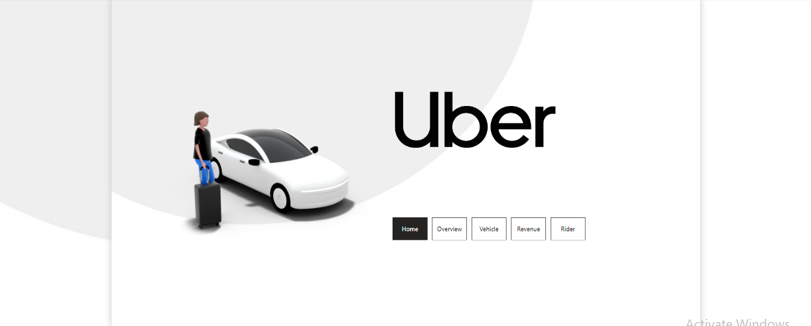
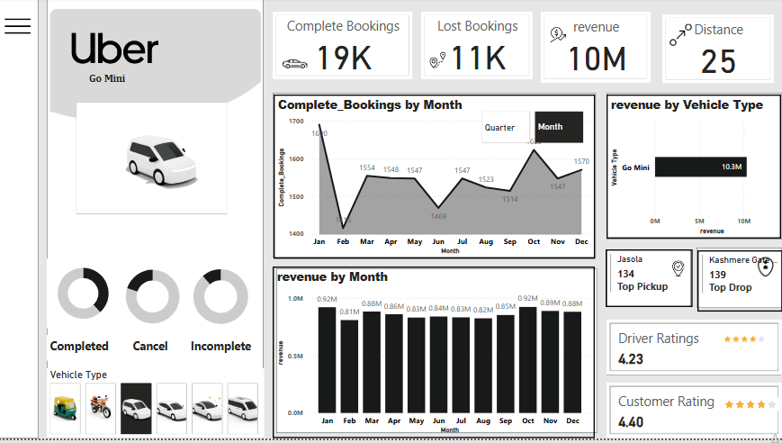
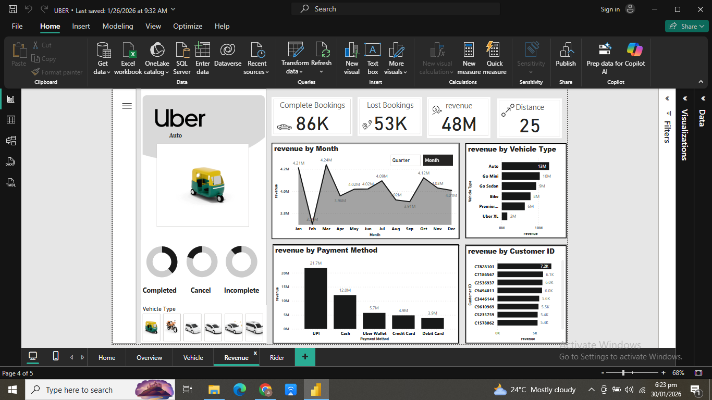
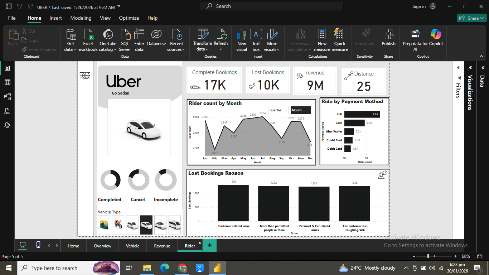

# Uber-Analysis-Dashboard
An interactive Power BI dashboard analyzing Uber bookings, revenue trends by vehicle type, month, and payment method, with rider insights, lost bookings reasons, and performance ratings.

## Features
- Multi-page dashboard (Home, Overview, Vehicle, Revenue, Rider)
- Key metrics: Complete/Lost Bookings, Total Revenue, Average Distance
- Trend analysis by month and quarter
- Breakdowns by vehicle type (Auto, Go Mini, Go Sedan, Bike, Premier, Uber XL)
- Payment method insights and top customer revenue
- Lost bookings reasons and rider ratings

## Screenshots

### Home Page

### Overview Page

### Vehicle Page

### Revenue Page

### Rider Page

## Requirements
- Microsoft Power BI Desktop (free version sufficient)

## How to Use
1. Download the `.pbix` file from this repository.
2. Open it in Power BI Desktop.
3. Explore the different report pages using the tabs at the bottom.

## Data Source
Sample Uber operations dataset (bookings, revenue, vehicle, and rider details).

---

Feel free to ⭐ the repo if you find it useful!
